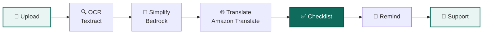
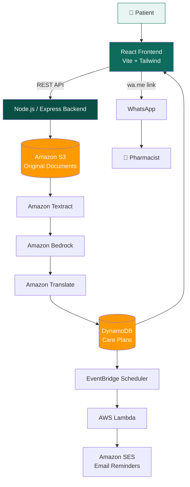
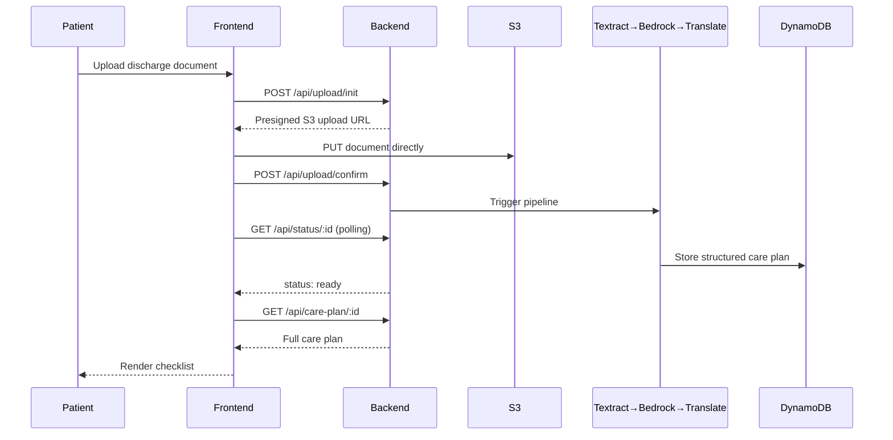

# CareSetu

**Your bridge from hospital to home recovery.**

Turns a confusing hospital discharge summary into a clear, local-language checklist a patient or caregiver can actually follow — without ever replacing a doctor's judgment.


Built by [Hardik Khanduja](https://github.com/Hardikkhanduja) & Kamal Kumar for **First Commit** (WeMakeDevs × AWS Bharat Builds Tour), Sept 17–20 2026 — Ship It track.

---

## The Problem

A patient leaves the hospital with a discharge summary full of dense clinical language — medication names, dosage timing, follow-up dates, warning signs — and is expected to correctly act on all of it, often in a language they don't read fluently.

Miss a detail in that document and it can mean a missed dose, a missed follow-up appointment, or missing an early warning sign that needed a hospital visit. The clinical encounter ends at discharge — but the patient's ability to safely *act* on their instructions often doesn't really begin until well after the hospital's involvement ends. That gap is what CareSetu closes.

## The Solution



*(Tip: click this diagram on GitHub to expand it — Mermaid diagrams render as zoomable SVGs natively.)*

1. **Upload** — patient or caregiver uploads a photo/scan of the discharge summary. No login — just an anonymous guest session.
2. **Extract** — Amazon Textract reads the document, including scanned and native-language originals.
3. **Simplify** — Amazon Bedrock rewrites dense clinical instructions into plain language.
4. **Translate** — Amazon Translate converts it into the patient's chosen language.
5. **Checklist** — the result becomes a structured care plan: medicines, daily tasks, follow-ups, warning signs, diet/activity guidance.
6. **Remind** — email reminders go out ahead of follow-up dates (30 / 7 / 3 days before).
7. **Support** — patient finds a nearby pharmacy and shares their prescription with the pharmacist over WhatsApp, one tap.

The original document is **never discarded** — it's always one tap away from the simplified version, so nothing is silently altered.

## ⚠️ What This Is NOT

> CareSetu does **not** diagnose, does **not** prescribe or change medication, and does **not** substitute a doctor's judgment. It only explains and organizes what's already written in the document the patient uploaded. Any instruction the AI is uncertain about is flagged for the patient to confirm with a clinician or pharmacist, rather than silently guessed.

## Key Features

<details>
<summary><strong>📋 Document Processing</strong></summary>

- Upload discharge summary as PDF or image
- OCR for typed, handwritten, and scanned documents
- AI-based simplification of medical instructions
- Translation into English, Hindi, Punjabi, Kannada, Malayalam, Tamil, Telugu
- Original document always preserved and viewable
</details>

<details>
<summary><strong>✅ Care Plan</strong></summary>

- Medicine checklist with dosage and timing
- Daily care task list
- Follow-up and appointment tracker
- Warning signs & restrictions section, visually distinct
- Diet/activity guidance
- Medication items the AI is unsure about are flagged `reviewRequired` and always shown with a visible confirm-with-doctor callout
</details>

<details>
<summary><strong>🔔 Reminders</strong></summary>

- Automated email reminders (Amazon SES) 30, 7, and 3 days before a follow-up
- WhatsApp reminders — planned, see [Roadmap](#known-limitations--roadmap)
</details>

<details>
<summary><strong>💊 Pharmacy & Support</strong></summary>

- Find nearby pharmacies with hours, contact, and directions
- Share the original prescription with a pharmacist over WhatsApp via a one-tap `wa.me` click-to-chat link — no WhatsApp Business API needed
</details>

## Architecture



<details>
<summary><strong>Sequence: what happens when a patient uploads a document</strong></summary>



</details>

## Tech Stack

| Layer | Technology |
|---|---|
| Frontend | React (Vite), Tailwind CSS, React Router, shadcn/ui |
| Backend | Node.js, Express, REST API, presigned S3 upload flow |
| AI / OCR | Amazon Textract, Amazon Bedrock, Amazon Translate |
| Data | Amazon DynamoDB |
| Storage | Amazon S3 |
| Reminders | EventBridge Scheduler, AWS Lambda, Amazon SES |
| Messaging | WhatsApp click-to-chat (`wa.me`) |
| CI/CD | GitHub, Jenkins |
| Hackathon compute | AWS Lambda + API Gateway |

## Team

| | Role |
|---|---|
| **Hardik Khanduja** | Full-stack / Product — React frontend, Node/Express backend, REST APIs, dashboard, upload & care-plan UI, pharmacy workflow, WhatsApp flow |
| **Kamal Kumar** | AWS / Cloud / AI Infrastructure — Textract, Bedrock, Translate, DynamoDB, EC2/Docker/CI-CD, EventBridge/Lambda reminders, IAM, CloudWatch |

## Getting Started

### Frontend
```bash
cd frontend
npm install
npm run dev        # starts Vite dev server on :5173, proxies /api to :4000
```

### Backend
```bash
cd backend
npm install
npm run mock       # local mock API matching the contract — no AWS needed
# or
npm start          # runs the real server (requires AWS credentials configured)
```

The frontend talks to whichever backend is running on `:4000` — use `npm run mock` for UI development without touching AWS, and `npm start` once the real pipeline is wired up.

## API Endpoints

| Method | Endpoint | Purpose |
|---|---|---|
| `POST` | `/api/session` | Create/reuse an anonymous guest session |
| `POST` | `/api/upload/init` | Validate upload, return a presigned S3 URL |
| `POST` | `/api/upload/confirm` | Confirm the file landed in S3, trigger the pipeline |
| `GET` | `/api/status/:id` | Poll pipeline status: `processing \| ready \| error` |
| `GET` | `/api/care-plan/:id` | Fetch the full structured care plan |

Full contract: [`docs/API_CONTRACT.md`](docs/API_CONTRACT.md)

## Project Structure

<details>
<summary>Click to expand</summary>

```
HAKOps/
├── docs/
│   ├── API_CONTRACT.md         # binding frontend↔backend data contract
│   └── KIRO_PROMPTS.md
├── backend/
│   ├── package.json
│   └── src/
│       ├── mockServer.js       # mock API for local frontend dev
│       ├── server.js           # real server entry point
│       ├── routes/ controllers/ services/
├── frontend/
│   ├── package.json
│   ├── vite.config.js
│   └── src/
│       ├── data/carePlanApi.js # all API calls go through here
│       ├── utils/session.js    # guest session management
│       ├── components/ pages/ context/ styles/
└── PROJECT_CONTEXT.md          # single source of truth for scope/decisions
```

</details>

## Known Limitations / Roadmap

- **Sessions are anonymous and browser-local** — clearing browser storage or switching devices loses access to the care plan. No login system, by design, to keep the flow frictionless. A recoverable-session option is a natural next step.
- **WhatsApp reminders are roadmap, not shipped** — the manual "share prescription via WhatsApp" flow is fully live; *automated* WhatsApp reminders need Meta Business API verification the team doesn't have yet. Email (SES) reminders are live today.
- **Find Pharmacy uses curated demo data**, not a live geolocation-based search — real nearby-pharmacy lookup (Google Places/OSM) is a planned next step.

## License

Hackathon submission — no license applied yet.

---

<p align="center">Built with care, for the moment care leaves the hospital with you.</p>
